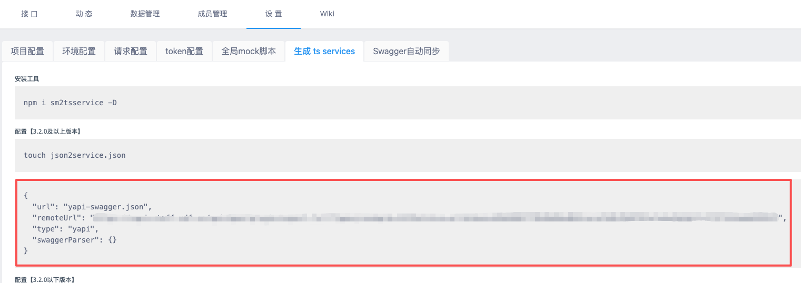

# YApi MCP Server

这是一个 Model Context Protocol (MCP) 服务器，用于与 YApi 接口管理平台集成，支持自动生成 TypeScript 类型定义、Mock 数据和 API 请求代码。

## ✨ 功能特性

### 🔧 核心功能

- **配置文件读取**: 自动读取项目中的 `yapi.config.json` 配置文件
- **YApi 数据获取**: 通过配置的 remoteUrl 获取 YApi 项目的完整接口信息（支持缓存）
- **TypeScript 类型生成**: 根据接口响应 Schema 自动生成 TypeScript interface 定义
- **Mock 数据生成**: 智能生成符合接口结构的 Mock 测试数据
- **API 请求代码生成**: 自动生成 Axios 或 Fetch 风格的 API 请求函数
- **智能缓存机制**: 自动缓存 YApi 数据 30 分钟，减少网络请求

## 快速开始

### 1. cursor 中安装 yapi-mcp-server

```json
{
	"yapi": {
		"command": "npx",
		"args": ["-y", "yapi-mcp-server", "--stdio"]
	}
}
```

### 2. 获取 yapi 参数



### 3. 项目中配置 yapi.config.json

在您的前端项目根目录下创建 `yapi.config.json` 文件：

```json
{
	"remoteUrl": "https://your-yapi-domain.com/api/open/plugin/export-full?type=json&pid=1437&status=all&token=your-token",
	"type": "yapi",
	"dataKey": "data",
	"mockPath": "src/mocks",
	"typePath": "src/types",
	"apiPath": "src/api"
}
```

#### 必填字段

- `remoteUrl`: YApi 项目导出接口 URL
- `type`: 平台类型，固定为 "yapi"

#### 可选字段

- `dataKey`: 响应数据字段名，默认 "data"
- `mockPath`: Mock 文件输出路径，默认 "src/mocks"
- `typePath`: 类型文件输出路径，默认 "src/types"
- `apiPath`: API 代码输出路径，默认 "src/api"

## 🛠️ 可用工具

本项目提供以下 5 个 MCP 工具，可以通过支持 MCP 协议的客户端（如 Claude Desktop、cursor）调用：

### 1️⃣ read_config - 读取配置文件

从项目中查找并读取 `yapi.config.json` 配置文件。

### 2️⃣ get_yapi_data - 获取 YApi 数据

从 YApi 服务器获取接口数据，支持缓存机制（30 分钟）。

### 3️⃣ generate_types - 生成 TypeScript 类型

根据接口 JSON Schema 生成 TypeScript 类型定义。

### 4️⃣ generate_mock_from_yapi - 生成 Mock 数据

根据接口 Schema 智能生成符合结构的 Mock 数据。

### 5️⃣ generate_api_code - 生成 API 请求代码

生成 Axios 或 Fetch 风格的 API 请求函数代码。

## 生成的文件示例

### TypeScript 类型定义

```typescript
/** 用户信息接口 */
export interface UserInfoData {
	/** 用户ID */
	userId: number
	/** 用户名 */
	username: string
	/** 邮箱 */
	email: string
}
```

### API 请求代码 (Axios)

```typescript
/**
 * 用户信息接口
 */
export const getUserInfo = async (): Promise<UserInfoData> => {
	const response = await axios.get('/api/user/info')
	return response.data
}
```

### Mock 数据

```json
{
	"code": "200",
	"success": true,
	"message": "操作成功",
	"data": {
		"userId": 12345,
		"username": "测试用户",
		"email": "test@example.com"
	}
}
```

## ⚙️ 环境变量

可通过环境变量配置日志级别：

```bash
# 设置日志级别 (ERROR | WARN | INFO | DEBUG)
export LOG_LEVEL=DEBUG
node server.js
```

## 📄 许可证

MIT License

## 🤝 支持与反馈

如有问题或建议，请通过 Issues 或内部渠道联系开发团队。
